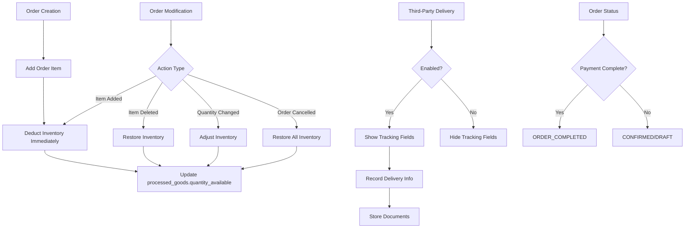

# Design Document: Inventory Deduction on Order Creation

## Overview

This design document outlines the technical approach for changing the inventory deduction mechanism from delivery-based to order-creation-based, while adding optional third-party delivery tracking capabilities. The current system deducts inventory when `quantity_delivered` is updated via a database trigger. The new system will deduct inventory immediately when order items are added, providing more accurate real-time inventory visibility.

The design maintains backward compatibility with existing orders and preserves historical delivery data while simplifying the order status flow to focus on payment completion rather than delivery status.

## Architecture

### High-Level Architecture



### System Components

1. **Inventory_Manager**: Manages inventory deduction and restoration
2. **Order_System**: Handles order creation, modification, and status management
3. **Delivery_Tracker**: Manages optional third-party delivery tracking
4. **Migration_Handler**: Handles backward compatibility and data migration

### Key Changes from Current System

**Current System:**
- Inventory deducted when `quantity_delivered` is updated
- Trigger: `reduce_inventory_on_delivery_trigger`
- Order status includes: PARTIALLY_DELIVERED, DELIVERY_COMPLETED
- Reservations track future inventory commitments

**New System:**
- Inventory deducted when order items are added/modified
- No delivery-based inventory deduction
- Order status: DRAFT → CONFIRMED → ORDER_COMPLETED (payment-based)
- Third-party delivery tracking is optional and for record-keeping only

## Components and Interfaces

### 1. Database Schema Changes

#### New Fields for Orders Table

```sql
-- Add third-party delivery tracking flag
ALTER TABLE orders
ADD COLUMN third_party_delivery_enabled boolean DEFAULT false;

-- Add migration flag to distinguish old orders
ALTER TABLE orders
ADD COLUMN created_before_migration boolean DEFAULT false;
```

#### New Table: Third-Party Delivery Tracking

```sql
CREATE TABLE third_party_deliveries (
  id uuid PRIMARY KEY DEFAULT gen_random_uuid(),
  order_id uuid REFERENCES orders(id) ON DELETE CASCADE,
  quantity_delivered numeric,
  delivery_partner_name text,
  delivery_notes text,
  created_at timestamptz DEFAULT now(),
  created_by uuid REFERENCES auth.users(id),
  updated_at timestamptz DEFAULT now()
);

-- Link documents to third-party deliveries
CREATE TABLE third_party_delivery_documents (
  id uuid PRIMARY KEY DEFAULT gen_random_uuid(),
  third_party_delivery_id uuid REFERENCES third_party_deliveries(id) ON DELETE CASCADE,
  document_id uuid REFERENCES documents(id) ON DELETE CASCADE,
  created_at timestamptz DEFAULT now()
);
```

#### Modified Order Status Values

```sql
-- Update order status constraint to new values
ALTER TABLE orders
DROP CONSTRAINT IF EXISTS orders_status_check;

ALTER TABLE orders
ADD CONSTRAINT orders_status_check 
CHECK (status IN ('DRAFT', 'CONFIRMED', 'ORDER_COMPLETED', 'CANCELLED', 
                  -- Legacy statuses for backward compatibility
                  'Draft', 'Confirmed', 'Partially Delivered', 'Fully Delivered'));
```

### 2. Inventory Management Component

#### Interface: InventoryManager

```typescript
interface InventoryManager {
  // Deduct inventory when order item is added
  deductInventory(processedGoodId: string, quantity: number): Promise<void>;
  
  // Restore inventory when order item is deleted or order cancelled
  restoreInventory(processedGoodId: string, quantity: number): Promise<void>;
  
  // Adjust inventory when order item quantity changes
  adjustInventory(processedGoodId: string, oldQuantity: number, newQuantity: number): Promise<void>;
  
  // Check if sufficient inventory is available
  checkAvailability(processedGoodId: string, quantity: number): Promise<boolean>;
  
  // Get current available quantity
  getAvailableQuantity(processedGoodId: string): Promise<number>;
}
```

#### Implementation Details

**Inventory Deduction Logic:**
```typescript
async function deductInventory(processedGoodId: string, quantity: number): Promise<void> {
  // 1. Check current available quantity
  const available = await getAvailableQuantity(processedGoodId);
  
  // 2. Validate sufficient inventory
  if (available < quantity) {
    throw new Error(`Insufficient inventory. Available: ${available}, Required: ${quantity}`);
  }
  
  // 3. Deduct from quantity_available
  await supabase
    .from('processed_goods')
    .update({ quantity_available: available - quantity })
    .eq('id', processedGoodId);
  
  // 4. Log the inventory change for audit
  await logInventoryChange(processedGoodId, -quantity, 'ORDER_ITEM_ADDED');
}
```

**Inventory Restoration Logic:**
```typescript
async function restoreInventory(processedGoodId: string, quantity: number): Promise<void> {
  // 1. Get current available quantity
  const current = await getAvailableQuantity(processedGoodId);
  
  // 2. Restore to quantity_available
  await supabase
    .from('processed_goods')
    .update({ quantity_available: current + quantity })
    .eq('id', processedGoodId);
  
  // 3. Log the inventory change for audit
  await logInventoryChange(processedGoodId, quantity, 'ORDER_ITEM_DELETED');
}
```

### 3. Order Management Component

#### Modified Functions

**addOrderItem (Updated):**
```typescript
async function addOrderItem(
  orderId: string,
  itemData: OrderItemFormData
): Promise<OrderWithItems> {
  // 1. Check if order is locked or cancelled
  const order = await fetchOrder(orderId);
  if (order.is_locked) throw new Error('Order is locked');
  if (order.status === 'CANCELLED') throw new Error('Cannot add items to cancelled order');
  
  // 2. Check if order was created before migration
  if (order.created_before_migration) {
    throw new Error('Cannot modify orders created before migration');
  }
  
  // 3. Deduct inventory immediately
  await inventoryManager.deductInventory(
    itemData.processed_good_id,
    itemData.quantity
  );
  
  // 4. Create order item (no reservation needed)
  const item = await createOrderItemRecord(orderId, itemData);
  
  // 5. Recalculate order total
  await recalculateOrderTotal(orderId);
  
  return fetchOrderWithItems(orderId);
}
```

**updateOrderItem (Updated):**
```typescript
async function updateOrderItem(
  orderId: string,
  itemId: string,
  updates: Partial<OrderItemFormData>
): Promise<OrderWithItems> {
  // 1. Validate order can be modified
  const order = await fetchOrder(orderId);
  if (order.is_locked) throw new Error('Order is locked');
  if (order.created_before_migration) {
    throw new Error('Cannot modify orders created before migration');
  }
  
  // 2. Get current item
  const currentItem = await fetchOrderItem(itemId);
  
  // 3. If quantity changed, adjust inventory
  if (updates.quantity !== undefined && updates.quantity !== currentItem.quantity) {
    await inventoryManager.adjustInventory(
      currentItem.processed_good_id,
      currentItem.quantity,
      updates.quantity
    );
  }
  
  // 4. If processed_good_id changed, restore old and deduct new
  if (updates.processed_good_id !== undefined && 
      updates.processed_good_id !== currentItem.processed_good_id) {
    await inventoryManager.restoreInventory(
      currentItem.processed_good_id,
      currentItem.quantity
    );
    await inventoryManager.deductInventory(
      updates.processed_good_id,
      updates.quantity || currentItem.quantity
    );
  }
  
  // 5. Update order item record
  await updateOrderItemRecord(itemId, updates);
  
  // 6. Recalculate order total
  await recalculateOrderTotal(orderId);
  
  return fetchOrderWithItems(orderId);
}
```

**deleteOrderItem (Updated):**
```typescript
async function deleteOrderItem(
  orderId: string,
  itemId: string
): Promise<OrderWithItems> {
  // 1. Validate order can be modified
  const order = await fetchOrder(orderId);
  if (order.is_locked) throw new Error('Order is locked');
  if (order.created_before_migration) {
    throw new Error('Cannot modify orders created before migration');
  }
  
  // 2. Get current item
  const currentItem = await fetchOrderItem(itemId);
  
  // 3. Restore inventory
  await inventoryManager.restoreInventory(
    currentItem.processed_good_id,
    currentItem.quantity
  );
  
  // 4. Delete order item record
  await deleteOrderItemRecord(itemId);
  
  // 5. Recalculate order total
  await recalculateOrderTotal(orderId);
  
  return fetchOrderWithItems(orderId);
}
```

**updateOrderStatus (Updated):**
```typescript
async function updateOrderStatus(
  orderId: string,
  status: OrderStatus
): Promise<Order> {
  // 1. Validate order can be modified
  const order = await fetchOrder(orderId);
  if (order.is_locked) throw new Error('Order is locked');
  
  // 2. Handle cancellation - restore all inventory
  if (status === 'CANCELLED' && order.status !== 'CANCELLED') {
    // Only restore inventory for orders created after migration
    if (!order.created_before_migration) {
      const items = await fetchOrderItems(orderId);
      for (const item of items) {
        await inventoryManager.restoreInventory(
          item.processed_good_id,
          item.quantity
        );
      }
    }
    
    // Delete reservations (for backward compatibility)
    await deleteOrderReservations(orderId);
  }
  
  // 3. Prevent manual setting of ORDER_COMPLETED
  if (status === 'ORDER_COMPLETED') {
    throw new Error('ORDER_COMPLETED is automatically set when payment is complete');
  }
  
  // 4. Update order status
  await updateOrderStatusRecord(orderId, status);
  
  return fetchOrder(orderId);
}
```

### 4. Third-Party Delivery Tracking Component

#### Interface: DeliveryTracker

```typescript
interface ThirdPartyDelivery {
  id: string;
  order_id: string;
  quantity_delivered?: number;
  delivery_partner_name?: string;
  delivery_notes?: string;
  created_at: string;
  updated_at: string;
}

interface DeliveryTracker {
  // Enable/disable third-party delivery tracking for an order
  setThirdPartyDeliveryEnabled(orderId: string, enabled: boolean): Promise<void>;
  
  // Record third-party delivery information
  recordThirdPartyDelivery(delivery: Partial<ThirdPartyDelivery>): Promise<ThirdPartyDelivery>;
  
  // Update third-party delivery information
  updateThirdPartyDelivery(deliveryId: string, updates: Partial<ThirdPartyDelivery>): Promise<ThirdPartyDelivery>;
  
  // Upload delivery document
  uploadDeliveryDocument(deliveryId: string, file: File): Promise<string>;
  
  // Fetch delivery information for an order
  fetchThirdPartyDelivery(orderId: string): Promise<ThirdPartyDelivery | null>;
  
  // Fetch delivery documents
  fetchDeliveryDocuments(deliveryId: string): Promise<Document[]>;
}
```

#### Implementation Details

```typescript
async function recordThirdPartyDelivery(
  delivery: Partial<ThirdPartyDelivery>
): Promise<ThirdPartyDelivery> {
  // 1. Validate order has third-party delivery enabled
  const order = await fetchOrder(delivery.order_id);
  if (!order.third_party_delivery_enabled) {
    throw new Error('Third-party delivery tracking is not enabled for this order');
  }
  
  // 2. Create or update delivery record
  const { data, error } = await supabase
    .from('third_party_deliveries')
    .upsert({
      order_id: delivery.order_id,
      quantity_delivered: delivery.quantity_delivered,
      delivery_partner_name: delivery.delivery_partner_name,
      delivery_notes: delivery.delivery_notes,
      updated_at: new Date().toISOString()
    })
    .select()
    .single();
  
  if (error) throw error;
  
  // 3. Note: This does NOT affect inventory
  return data;
}

async function uploadDeliveryDocument(
  deliveryId: string,
  file: File
): Promise<string> {
  // 1. Upload file to storage
  const documentId = await uploadDocument(file, 'Transport Document');
  
  // 2. Link document to delivery
  await supabase
    .from('third_party_delivery_documents')
    .insert({
      third_party_delivery_id: deliveryId,
      document_id: documentId
    });
  
  return documentId;
}
```

### 5. Migration Handler Component

#### Interface: MigrationHandler

```typescript
interface MigrationHandler {
  // Mark existing orders as created before migration
  markExistingOrders(): Promise<void>;
  
  // Validate migration completed successfully
  validateMigration(): Promise<MigrationValidationResult>;
  
  // Rollback migration if needed
  rollbackMigration(): Promise<void>;
}
```

#### Migration Strategy

```sql
-- Migration script to mark existing orders
UPDATE orders
SET created_before_migration = true
WHERE created_at < '2025-02-XX 00:00:00'; -- Migration timestamp

-- Preserve existing delivery records
-- No changes needed - delivery_dispatches table remains intact

-- Preserve existing order statuses
-- No changes needed - old status values remain valid due to constraint update
```

## Data Models

### Updated Order Model

```typescript
interface Order {
  id: string;
  order_number: string;
  customer_id: string;
  customer_name?: string;
  order_date: string;
  status: OrderStatus; // 'DRAFT' | 'CONFIRMED' | 'ORDER_COMPLETED' | 'CANCELLED'
  payment_status?: PaymentStatus;
  notes?: string;
  sold_by?: string;
  sold_by_name?: string;
  total_amount: number;
  discount_amount: number;
  is_locked: boolean;
  completed_at?: string;
  third_party_delivery_enabled: boolean; // NEW
  created_before_migration: boolean; // NEW
  created_at: string;
  created_by?: string;
  updated_at: string;
}
```

### New Third-Party Delivery Model

```typescript
interface ThirdPartyDelivery {
  id: string;
  order_id: string;
  quantity_delivered?: number;
  delivery_partner_name?: string;
  delivery_notes?: string;
  created_at: string;
  created_by?: string;
  updated_at: string;
}

interface ThirdPartyDeliveryDocument {
  id: string;
  third_party_delivery_id: string;
  document_id: string;
  document: Document;
  created_at: string;
}
```

### Updated OrderItem Model

```typescript
interface OrderItem {
  id: string;
  order_id: string;
  processed_good_id: string;
  product_type: string;
  form?: string;
  size?: string;
  quantity: number;
  quantity_delivered: number; // Kept for backward compatibility
  unit_price: number;
  unit: string;
  line_total: number;
  created_at: string;
  processed_good_batch_reference?: string;
  processed_good_quantity_available?: number;
}
```

## Correctness Properties

*A property is a characteristic or behavior that should hold true across all valid executions of a system—essentially, a formal statement about what the system should do. Properties serve as the bridge between human-readable specifications and machine-verifiable correctness guarantees.*


### Property 1: Immediate Inventory Deduction on Item Addition

*For any* order item with a valid processed good and quantity, when the item is added to an order, the processed_goods.quantity_available should be reduced by exactly the item quantity.

**Validates: Requirements 1.1**

### Property 2: Inventory Adjustment on Quantity Changes

*For any* order item, when its quantity is changed from an old value to a new value, the processed_goods.quantity_available should be adjusted by the difference (new_quantity - old_quantity), where positive differences deduct inventory and negative differences restore inventory.

**Validates: Requirements 1.2, 1.3**

### Property 3: Complete Inventory Restoration on Item or Order Removal

*For any* order item or order, when the item is deleted or the order is cancelled/deleted, all associated inventory quantities should be fully restored to processed_goods.quantity_available.

**Validates: Requirements 1.4, 1.5, 7.2**

### Property 4: Insufficient Inventory Rejection

*For any* order item addition or quantity increase, if the requested quantity exceeds the available quantity in processed_goods.quantity_available, the operation should be rejected with an error message indicating the available quantity.

**Validates: Requirements 1.6**

### Property 5: Delivery Operations Do Not Affect Inventory

*For any* order item, when quantity_delivered is updated or delivery records are created/modified, the processed_goods.quantity_available should remain unchanged.

**Validates: Requirements 2.1, 2.2**

### Property 6: Third-Party Delivery Field Conditional Rendering

*For any* order, the delivery tracking fields (quantity_delivered, delivery_partner_name, delivery_notes, document uploads) should be visible in the UI if and only if third_party_delivery_enabled is true.

**Validates: Requirements 3.2, 3.3**

### Property 7: Third-Party Delivery Data Persistence

*For any* third-party delivery record, all entered data (quantity_delivered, delivery_partner_name, delivery_notes) should persist correctly and be retrievable without affecting inventory.

**Validates: Requirements 3.4, 3.5, 3.7, 3.8**

### Property 8: Document Upload and Management

*For any* third-party delivery, multiple documents in supported formats (PDF, JPG, PNG) should be uploadable, retrievable, and deletable, with each document maintaining its upload timestamp and uploader information.

**Validates: Requirements 6.1, 6.2, 6.3, 6.4, 6.5, 6.6**

### Property 9: New Order Status Restrictions

*For any* order created after migration (created_before_migration = false), attempting to set the status to legacy values (PARTIALLY_DELIVERED, DELIVERY_COMPLETED) should be rejected.

**Validates: Requirements 4.2, 4.3**

### Property 10: Payment-Based Order Completion

*For any* order, when the total payments equal or exceed the net total (total_amount - discount_amount), the order status should automatically transition to ORDER_COMPLETED, regardless of delivery status.

**Validates: Requirements 4.4, 4.5**

### Property 11: Migration Flag Prevents New Logic Application

*For any* order with created_before_migration = true, attempting to add, modify, or delete order items should be rejected, preventing the new inventory deduction logic from affecting historical orders.

**Validates: Requirements 5.5, 8.3**

### Property 12: Historical Delivery Data Accessibility

*For any* order created before migration, all associated delivery records and delivery_dispatches should remain accessible and viewable without modification.

**Validates: Requirements 5.4, 5.6**

### Property 13: Status Transition Inventory Restoration

*For any* order transitioning from CONFIRMED to DRAFT, all order item quantities should be restored to processed_goods.quantity_available.

**Validates: Requirements 7.1**

### Property 14: Transaction Rollback on Failure

*For any* order item modification operation that fails, all inventory changes made during that operation should be rolled back, leaving processed_goods.quantity_available unchanged from its pre-operation value.

**Validates: Requirements 7.3**

### Property 15: Non-Negative Inventory Invariant

*For any* processed good at any point in time, the quantity_available should never be negative (quantity_available >= 0).

**Validates: Requirements 7.4**

### Property 16: Inventory Change Audit Logging

*For any* inventory restoration operation (item deletion, order cancellation, quantity decrease), an audit log entry should be created recording the processed_good_id, quantity change, and operation type.

**Validates: Requirements 7.5**

## Error Handling

### Inventory Errors

1. **Insufficient Inventory**: When adding or increasing order items
   - Error: "Insufficient inventory. Available: {available} {unit}, Required: {required} {unit}"
   - Action: Reject operation, maintain current state

2. **Negative Inventory Prevention**: When operations would result in negative quantity_available
   - Error: "Operation would result in negative inventory"
   - Action: Reject operation, maintain current state

### Order Modification Errors

1. **Locked Order**: When attempting to modify a locked order
   - Error: "Order is locked and cannot be modified"
   - Action: Reject operation

2. **Historical Order Modification**: When attempting to modify orders created before migration
   - Error: "Cannot modify orders created before migration"
   - Action: Reject operation

3. **Cancelled Order Modification**: When attempting to add items to a cancelled order
   - Error: "Cannot add items to a cancelled order"
   - Action: Reject operation

### Third-Party Delivery Errors

1. **Delivery Tracking Not Enabled**: When attempting to record delivery without flag enabled
   - Error: "Third-party delivery tracking is not enabled for this order"
   - Action: Reject operation

2. **Unsupported File Format**: When uploading documents in unsupported formats
   - Error: "Unsupported file format. Supported formats: PDF, JPG, PNG"
   - Action: Reject upload

### Transaction Errors

1. **Database Transaction Failure**: When any database operation fails
   - Action: Rollback all changes in the transaction
   - Log error for debugging
   - Return user-friendly error message

## Testing Strategy

### Dual Testing Approach

This feature requires both unit tests and property-based tests to ensure comprehensive coverage:

- **Unit tests**: Verify specific examples, edge cases, and error conditions
- **Property tests**: Verify universal properties across all inputs through randomization

### Property-Based Testing

**Library Selection**: Use `fast-check` for TypeScript/JavaScript property-based testing

**Configuration**:
- Minimum 100 iterations per property test
- Each property test must reference its design document property
- Tag format: `Feature: inventory-deduction-on-order-creation, Property {number}: {property_text}`

**Property Test Examples**:

```typescript
// Property 1: Immediate Inventory Deduction
// Feature: inventory-deduction-on-order-creation, Property 1: Immediate Inventory Deduction on Item Addition
test('adding order item deducts inventory immediately', async () => {
  await fc.assert(
    fc.asyncProperty(
      fc.record({
        processedGoodId: fc.uuid(),
        initialQuantity: fc.integer({ min: 100, max: 1000 }),
        orderQuantity: fc.integer({ min: 1, max: 50 })
      }),
      async ({ processedGoodId, initialQuantity, orderQuantity }) => {
        // Setup: Create processed good with initial quantity
        await setupProcessedGood(processedGoodId, initialQuantity);
        
        // Action: Add order item
        await addOrderItem(orderId, {
          processed_good_id: processedGoodId,
          quantity: orderQuantity,
          // ... other fields
        });
        
        // Assert: Inventory reduced by order quantity
        const finalQuantity = await getAvailableQuantity(processedGoodId);
        expect(finalQuantity).toBe(initialQuantity - orderQuantity);
      }
    ),
    { numRuns: 100 }
  );
});

// Property 3: Complete Inventory Restoration
// Feature: inventory-deduction-on-order-creation, Property 3: Complete Inventory Restoration on Item or Order Removal
test('deleting order item restores full inventory', async () => {
  await fc.assert(
    fc.asyncProperty(
      fc.record({
        processedGoodId: fc.uuid(),
        initialQuantity: fc.integer({ min: 100, max: 1000 }),
        orderQuantity: fc.integer({ min: 1, max: 50 })
      }),
      async ({ processedGoodId, initialQuantity, orderQuantity }) => {
        // Setup: Create processed good and order item
        await setupProcessedGood(processedGoodId, initialQuantity);
        const itemId = await addOrderItem(orderId, {
          processed_good_id: processedGoodId,
          quantity: orderQuantity,
          // ... other fields
        });
        
        // Action: Delete order item
        await deleteOrderItem(orderId, itemId);
        
        // Assert: Inventory fully restored
        const finalQuantity = await getAvailableQuantity(processedGoodId);
        expect(finalQuantity).toBe(initialQuantity);
      }
    ),
    { numRuns: 100 }
  );
});

// Property 15: Non-Negative Inventory Invariant
// Feature: inventory-deduction-on-order-creation, Property 15: Non-Negative Inventory Invariant
test('inventory never becomes negative', async () => {
  await fc.assert(
    fc.asyncProperty(
      fc.record({
        processedGoodId: fc.uuid(),
        initialQuantity: fc.integer({ min: 10, max: 100 }),
        operations: fc.array(
          fc.record({
            type: fc.constantFrom('add', 'delete', 'update'),
            quantity: fc.integer({ min: 1, max: 20 })
          }),
          { minLength: 1, maxLength: 10 }
        )
      }),
      async ({ processedGoodId, initialQuantity, operations }) => {
        // Setup: Create processed good
        await setupProcessedGood(processedGoodId, initialQuantity);
        
        // Action: Perform random operations
        for (const op of operations) {
          try {
            if (op.type === 'add') {
              await addOrderItem(orderId, {
                processed_good_id: processedGoodId,
                quantity: op.quantity,
                // ... other fields
              });
            }
            // ... other operations
          } catch (error) {
            // Operations may fail due to insufficient inventory, which is expected
          }
        }
        
        // Assert: Inventory never negative
        const finalQuantity = await getAvailableQuantity(processedGoodId);
        expect(finalQuantity).toBeGreaterThanOrEqual(0);
      }
    ),
    { numRuns: 100 }
  );
});
```

### Unit Testing

**Focus Areas**:
- Specific edge cases (zero quantity, maximum quantity)
- Error conditions (insufficient inventory, locked orders)
- Integration points (database transactions, UI components)
- Migration scenarios (old vs new orders)

**Example Unit Tests**:

```typescript
describe('Order Item Management', () => {
  test('adding item with zero quantity throws error', async () => {
    await expect(
      addOrderItem(orderId, { quantity: 0, /* ... */ })
    ).rejects.toThrow('Quantity must be greater than 0');
  });
  
  test('adding item to locked order throws error', async () => {
    await lockOrder(orderId);
    await expect(
      addOrderItem(orderId, { quantity: 10, /* ... */ })
    ).rejects.toThrow('Order is locked');
  });
  
  test('adding item to historical order throws error', async () => {
    const historicalOrder = await createHistoricalOrder();
    await expect(
      addOrderItem(historicalOrder.id, { quantity: 10, /* ... */ })
    ).rejects.toThrow('Cannot modify orders created before migration');
  });
});

describe('Third-Party Delivery Tracking', () => {
  test('recording delivery without enabled flag throws error', async () => {
    const order = await createOrder({ third_party_delivery_enabled: false });
    await expect(
      recordThirdPartyDelivery({ order_id: order.id, /* ... */ })
    ).rejects.toThrow('Third-party delivery tracking is not enabled');
  });
  
  test('uploading unsupported file format throws error', async () => {
    const delivery = await createThirdPartyDelivery();
    const file = new File(['content'], 'test.txt', { type: 'text/plain' });
    await expect(
      uploadDeliveryDocument(delivery.id, file)
    ).rejects.toThrow('Unsupported file format');
  });
});
```

### Integration Testing

**Test Scenarios**:
1. Complete order lifecycle (create → add items → modify → complete payment → verify status)
2. Order cancellation flow (create → add items → cancel → verify inventory restored)
3. Third-party delivery workflow (enable tracking → record delivery → upload documents → verify data)
4. Migration compatibility (verify old orders remain functional, new orders use new logic)

### Database Testing

**Test Scenarios**:
1. Transaction rollback on failure
2. Concurrent order modifications
3. Inventory consistency under load
4. Migration script validation

## Implementation Notes

### Database Triggers to Remove

The following triggers must be disabled or removed as they implement the old delivery-based inventory deduction:

1. `reduce_inventory_on_delivery_trigger` - Deducts inventory when quantity_delivered changes
2. `update_order_status_on_delivery` - Updates order status based on delivery

### Database Triggers to Keep

The following triggers should remain as they're still needed:

1. `update_order_total_on_item_change` - Recalculates order total when items change
2. `update_orders_updated_at` - Updates timestamp on order changes
3. `handle_order_cancellation_trigger` - Handles reservation cleanup (for backward compatibility)

### New Database Functions Needed

```sql
-- Function to check if order can be modified (not locked, not historical)
CREATE OR REPLACE FUNCTION can_modify_order(order_id_param uuid)
RETURNS boolean AS $
DECLARE
  order_record RECORD;
BEGIN
  SELECT is_locked, created_before_migration, status
  INTO order_record
  FROM orders
  WHERE id = order_id_param;
  
  IF order_record.is_locked THEN
    RETURN false;
  END IF;
  
  IF order_record.created_before_migration THEN
    RETURN false;
  END IF;
  
  IF order_record.status = 'CANCELLED' THEN
    RETURN false;
  END IF;
  
  RETURN true;
END;
$ LANGUAGE plpgsql;

-- Function to log inventory changes for audit
CREATE OR REPLACE FUNCTION log_inventory_change(
  processed_good_id_param uuid,
  quantity_change numeric,
  operation_type text
)
RETURNS void AS $
BEGIN
  INSERT INTO stock_movements_ledger (
    processed_good_id,
    quantity_change,
    movement_type,
    reference_type,
    created_at
  )
  VALUES (
    processed_good_id_param,
    quantity_change,
    operation_type,
    'ORDER_ITEM',
    now()
  );
END;
$ LANGUAGE plpgsql;
```

### Frontend Components to Update

1. **OrderDetail.tsx**: Add third-party delivery tracking section
2. **OrderItemForm.tsx**: Update to show real-time inventory deduction
3. **OrderStatusBadge.tsx**: Update to show new status values
4. **DeliveryTrackingSection.tsx**: New component for third-party delivery

### API Endpoints to Update

1. `POST /api/orders/:id/items` - Add inventory deduction logic
2. `PUT /api/orders/:id/items/:itemId` - Add inventory adjustment logic
3. `DELETE /api/orders/:id/items/:itemId` - Add inventory restoration logic
4. `PUT /api/orders/:id/status` - Update status transition logic
5. `POST /api/orders/:id/third-party-delivery` - New endpoint for delivery tracking
6. `POST /api/orders/:id/third-party-delivery/documents` - New endpoint for document upload

### Migration Checklist

1. ✅ Create migration script to mark existing orders
2. ✅ Add new database fields (third_party_delivery_enabled, created_before_migration)
3. ✅ Create third_party_deliveries and related tables
4. ✅ Update order status constraint to include new values
5. ✅ Disable old inventory deduction triggers
6. ✅ Create new database functions
7. ✅ Update frontend components
8. ✅ Update API endpoints
9. ✅ Run migration validation
10. ✅ Deploy with rollback plan ready
