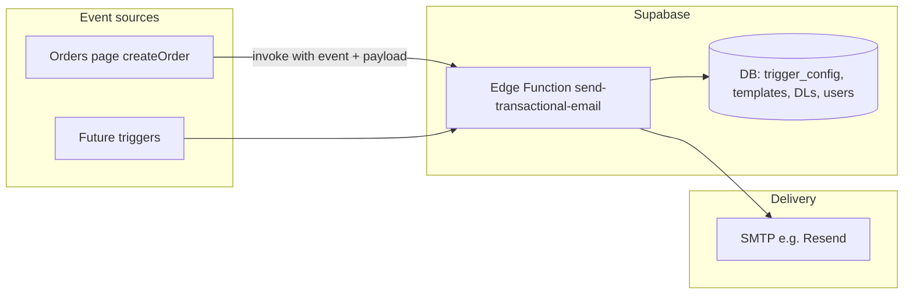

# Transactional Email System

This document describes the event-driven transactional email feature in Hatvoni Insider: how it was implemented, how it works, what to configure, and how to extend or troubleshoot it.

---

## Table of Contents

1. [Overview](#overview)
2. [Architecture](#architecture)
3. [Implementation Summary](#implementation-summary)
4. [Configuration & Setup](#configuration--setup)
5. [How Triggers Work](#how-triggers-work)
6. [Template Design](#template-design)
7. [Distribution Lists](#distribution-lists)
8. [Admin Interface](#admin-interface)
9. [File Reference](#file-reference)
10. [Adding a New Trigger](#adding-a-new-trigger)
11. [Troubleshooting](#troubleshooting)

---

## Overview

The transactional email system sends automated emails when certain events occur in the application (e.g. when a sale/order is created). Each event is mapped to an **email template** and a **distribution list (DL)** of recipients. Emails are sent via **SMTP** (e.g. Resend) from a Supabase Edge Function.

**Key concepts:**

- **Trigger:** A system event (e.g. `sale_created`) that can fire an email.
- **Template:** Subject and body (HTML/text) with placeholders (e.g. `{{order_number}}`).
- **Distribution list:** A named list of app users (employees) who receive the email.
- **Trigger config:** Links a trigger to one template and one distribution list, and can be enabled/disabled.

Only **admins** can manage distribution lists, templates, and trigger configuration via **Admin → Transactional Email**.

---

## Architecture

**Flow (high level):**

1. An event occurs (e.g. user creates an order).
2. The app calls the Edge Function with `{ event: "sale_created", payload: { order_number, customer_name, ... } }`.
3. The Edge Function (using the service role) reads **trigger config** for that event: which template and which distribution list, and whether it’s enabled.
4. It loads the **template** (subject, body) and the **DL members**, then resolves each member’s **email** from `public.users` or, if missing, from **Supabase Auth** (`auth_user_id`).
5. It replaces placeholders in subject/body with values from `payload`.
6. It sends one email per recipient via **SMTP** (denomailer).
7. It logs the send (and errors) to `email_send_log`.

---

## Implementation Summary

| Layer          | Technology                    | Purpose                                                                                                            |
| -------------- | ----------------------------- | ------------------------------------------------------------------------------------------------------------------ |
| **Database**   | PostgreSQL (Supabase)         | Tables: distribution lists, members, templates, trigger config, send log. RLS: admin-only.                         |
| **Backend**    | Supabase Edge Function (Deno) | Single function: `send-transactional-email`. Reads config, resolves emails, renders template, sends via SMTP.      |
| **SMTP**       | Resend (or any SMTP)          | Credentials in Edge Function secrets. Function uses denomailer to send.                                            |
| **Frontend**   | React (Admin page)            | Admin UI: manage DLs, members, templates, trigger config; “Send test email” for sale_created.                      |
| **Invocation** | Client-side after action      | e.g. After `createOrder()` in `Orders.tsx`, the app calls the Edge Function with `sale_created` and order payload. |

**Design decisions:**

- **No JWT verification** on the Edge Function (`verify_jwt: false`) so the client can invoke it without token issues; the anon key is still required.
- **Email resolution:** Prefer `public.users.email`; if empty, fall back to Supabase Auth via `auth_user_id` so login email is used when the profile email is not set.
- **One email per recipient:** The SMTP client (denomailer) is called once per address to avoid “No valid emails provided!” with comma-separated `to`.

---

## Configuration & Setup

### 1. Database

Migrations create and seed the schema. Ensure the migration that creates the transactional email tables has been applied (e.g. via Supabase MCP or `supabase db push`).

**Tables:**

- `email_distribution_lists` – name, description
- `email_distribution_list_members` – `distribution_list_id`, `user_id` (FK to `users.id`)
- `email_templates` – `trigger_key`, name, subject, body_html, body_text, is_system
- `email_trigger_config` – `trigger_key`, template_id, distribution_list_id, enabled
- `email_send_log` – audit (trigger_key, recipient_count, payload_snapshot, error_message)

A seed row for the **sale_created** template is inserted by the migration.

### 2. Edge Function

Deploy the function (e.g. via Supabase MCP or CLI):

- **Name:** `send-transactional-email`
- **Entrypoint:** `supabase/functions/send-transactional-email/index.ts`
- **Verify JWT:** disabled so the app can call it with the anon key.

### 3. SMTP (e.g. Resend)

Configure Edge Function **secrets** in Supabase: **Project Settings → Edge Functions → Secrets**.

| Secret            | Required | Description                                      | Example (Resend)                                  |
| ----------------- | -------- | ------------------------------------------------ | ------------------------------------------------- |
| `SMTP_HOST`       | Yes      | SMTP server hostname                             | `smtp.resend.com`                                 |
| `SMTP_PORT`       | Yes      | Port (465 for TLS, 587 for STARTTLS)             | `465` or `587`                                    |
| `SMTP_USER`       | Yes      | SMTP username                                    | `resend`                                          |
| `SMTP_PASSWORD`   | Yes      | SMTP password / API key                         | Your Resend API key                               |
| `SMTP_FROM`       | Yes      | From email (must be allowed by provider)         | `noreply@hatvoni.tech` or `onboarding@resend.dev` |
| `SMTP_FROM_NAME`  | No       | Display name next to From address                | `Hatvoni Insider`                                 |
| `SMTP_SECURE`     | No       | Use TLS from start; set `true` for port 465      | `true` (for 465)                                  |

**Resend:** Verify your domain in Resend (or use `onboarding@resend.dev` for testing). Use port **465** with `SMTP_SECURE=true`, or **587** with `SMTP_SECURE=false`.

**Professional sender (display name + avatar):**

- **Proper From address:** Use a verified domain address, e.g. `noreply@hatvoni.tech`. In Resend, add and verify the domain `hatvoni.tech`, then set `SMTP_FROM=noreply@hatvoni.tech`.
- **Display name:** Set `SMTP_FROM_NAME=Hatvoni Insider` (or your brand name). Recipients see **Hatvoni Insider** &lt;noreply@hatvoni.tech&gt; instead of a raw address.
- **Sender avatar (DP):** Many clients (Gmail, Outlook) show a small image next to the sender. Options:
  - **Gravatar:** Create a [Gravatar](https://gravatar.com) account for `noreply@hatvoni.tech` and upload your logo; clients that support Gravatar will show it.
  - **Logo in email body:** Add your logo at the top of the HTML template in Admin → Templates (e.g. ``) so the email is clearly branded.

### 4. Admin setup (first use)

1. Log in as an **admin** user.
2. Go to **Admin → Transactional Email**.
3. **Distribution Lists:** Create at least one list (e.g. “Sales team”) and add members (users). Members must have an email in **Users** or in Auth (login email).
4. **Triggers:** For **Sale created**, select the “Sale created notification” template and your distribution list, check **Enabled**, and click **Save**.
5. Use **Send test email** to verify end-to-end.

---

## How Triggers Work

1. **Trigger key** – A string that identifies the event (e.g. `sale_created`, `order_completed`, `order_locked`, `order_unlocked`, `order_hold`, `order_hold_removed`). Defined in code and in the DB (templates, trigger config).
2. **When the event happens** – The app (or a future DB webhook) calls the Edge Function with:
  - `event`: the trigger key
  - `payload`: a JSON object with data to fill the template (e.g. `order_number`, `customer_name`).
3. **Edge Function** – Loads `email_trigger_config` for that `trigger_key`. If disabled or missing, returns without sending. Otherwise loads the linked template and distribution list, resolves recipient emails (from `users` or Auth), replaces placeholders, and sends one email per recipient via SMTP.
4. **Trigger config** – Stored in `email_trigger_config`: one row per trigger key, with `template_id`, `distribution_list_id`, and `enabled`. Admins set this in **Admin → Transactional Email → Triggers**.

---

## Template Design

- **Storage:** `email_templates` table. Each row has a unique `trigger_key`, plus `name`, `subject`, `body_html`, `body_text`, and `is_system`.
- **Placeholders:** Use double curly braces, e.g. `{{order_number}}`, `{{customer_name}}`. The Edge Function replaces these with values from the event `payload`; missing keys become empty string.
- **Editing:** Admins can edit subject and body (HTML and optional plain text) in **Admin → Transactional Email → Templates**. A note on the page lists available placeholders for each trigger.
- **Sales/order placeholders (all lifecycle triggers):** `{{event_message}}`, `{{order_number}}`, `{{order_date_formatted}}`, `{{customer_name}}`, `{{customer_phone}}`, `{{customer_address}}`, `{{customer_type}}`, `{{contact_person}}`, `{{status}}`, `{{payment_status}}`, `{{items_table}}` (HTML rows for itemized table), `{{total_amount_formatted}}`, `{{discount_amount_formatted}}`, `{{net_amount_formatted}}`, `{{total_paid_formatted}}`, `{{sold_by_name}}`, `{{completed_at_formatted}}`, `{{locked_at_formatted}}`, `{{locked_by_name}}`, `{{hold_reason}}`, `{{held_at_formatted}}`, `{{held_by_name}}`, `{{unlock_reason}}`, `{{notes}}`.

**Best practices:**

- Keep subject short and include one or two key placeholders.
- Provide both `body_html` and `body_text` when possible; the function falls back to stripping HTML from `body_html` if `body_text` is empty.
- Test after changing templates using **Send test email**.

---

## Distribution Lists

- **Purpose:** Define who receives emails for a given trigger (e.g. “Sales team”, “Finance”).
- **Members:** Users from the app’s **Users** table (`public.users`). Add/remove members in **Admin → Transactional Email → Distribution Lists → Manage members**.
- **Email resolution:** For each member, the Edge Function uses `public.users.email` first; if that is null or empty, it uses the email from **Supabase Auth** for that user’s `auth_user_id`. Members must have an email in at least one of these places to receive mail.
- **UI note:** The Admin UI states that members must have an email set in Users to receive emails (Auth fallback is handled in the function).

---

## Admin Interface

**Location:** **Admin → Transactional Email** (fourth main tab next to Tags, Units, Customer Types). Access is admin-only (same as rest of Admin).

**Sub-sections:**

1. **Distribution Lists** – Create/edit/delete lists; “Manage members” to add/remove users. Only active users with email appear in the add list.
2. **Triggers** – List of known triggers (e.g. Sale created). For each: choose **Template**, **Distribution list**, and **Enabled**; **Save**; for **sale_created**, **Send test email** is available.
3. **Templates** – List templates; edit subject and body (HTML); placeholder note is shown.

**SMTP note:** A banner explains that SMTP is configured in Supabase Dashboard → Edge Functions → Secrets (not in the app).

---

## File Reference

| Path                                                                       | Purpose                                                                                                                                                                        |
| -------------------------------------------------------------------------- | ------------------------------------------------------------------------------------------------------------------------------------------------------------------------------ |
| `supabase/migrations/20260221000000_create_transactional_email_tables.sql` | Creates tables, RLS, triggers, seed template for `sale_created`.                                                                                                               |
| `supabase/functions/send-transactional-email/index.ts`                     | Edge Function: reads config, resolves emails (users + Auth fallback), renders template, sends via SMTP (one email per recipient), logs to `email_send_log`.                    |
| `src/types/transactional-email.ts`                                         | Types: distribution list, member, template, trigger config; `TRANSACTIONAL_EMAIL_TRIGGER_KEYS` (e.g. `sale_created`).                                                          |
| `src/lib/transactional-email.ts`                                           | CRUD for DLs, members, templates, trigger config; `buildOrderEventPayload(order)`; `notifyTransactionEmail` (fire-and-forget); `sendTestTransactionEmail` (for Admin test button). |
| `src/pages/Admin.tsx`                                                      | Transactional Email section: DLs, Triggers, Templates UI and “Send test email”.                                                                                                |
| `src/pages/Orders.tsx`                                                     | After `createOrder()` success, calls `notifyTransactionEmail('sale_created', buildOrderEventPayload(newOrder))`.                                                               |
| `src/pages/OrderDetail.tsx`                                                | After `loadOrder()` when transitions are detected: `order_completed`, `order_locked`, `order_unlocked`, `order_hold`, `order_hold_removed` (each with full order payload).     |
| `supabase/migrations/20260221100000_add_sales_triggers_transactional_email.sql` | Seeds `email_templates` for order_completed, order_locked, order_unlocked, order_hold, order_hold_removed.                                                                     |
| `supabase/migrations/20260221110000_sales_email_templates_professional.sql`   | Updates all sales trigger templates with a modern, professional HTML email (order + customer + items table + totals + sales/status).                                            |

---

## Adding a New Trigger

To add a new event (e.g. `order_completed`):

1. **Database**
  - Insert a row into `email_templates` with a new `trigger_key`, name, subject, and body (with placeholders that match the payload you will send).
2. **Types**
  - In `src/types/transactional-email.ts`, add an entry to `TRANSACTIONAL_EMAIL_TRIGGER_KEYS`, e.g. `{ key: 'order_completed', label: 'Order completed' }`.
3. **Invocation**
  - Where the event occurs (e.g. when marking an order completed), call:
    - `notifyTransactionEmail('order_completed', { ...payload })`
    - or, for a test from Admin, use `sendTestTransactionEmail('order_completed', payload)`.
4. **Admin**
  - No code change needed: the Triggers list is driven by `TRANSACTIONAL_EMAIL_TRIGGER_KEYS`. Admins can assign a template and distribution list to the new trigger and enable it.
5. **Edge Function**
  - No change: it already looks up config by `event` (trigger key) and uses the linked template and DL.

---

## Troubleshooting

### "Invalid JWT" (401)

- The Edge Function was deployed with **verify JWT** enabled. Redeploy with **verify_jwt: false** so the client can invoke it with the anon key (no user JWT required).

### "No valid emails provided!"

- This message comes from the **denomailer** SMTP client when the `to` field is empty or in an invalid format.
- **Fix in code:** The function sends **one email per recipient** (single `to` string per call). If this error still appears, ensure the recipient list is not empty before calling `client.send()` and that each `to` is a non-empty string.
- **Fix in data:** Ensure every member of the chosen distribution list has an email:
  - In **Users**, set **Email** for each user, and/or
  - Ensure they signed up with email (Auth) so the function can fall back via `auth_user_id`.

### Emails not received

- **Trigger config:** In Admin → Triggers, confirm the trigger is **Enabled** and has a **Template** and **Distribution list** set and **Saved**.
- **DL members:** In **Manage members**, confirm each member shows an email (not “—”). If not, set email in Users or rely on Auth (login email).
- **SMTP:** Check Edge Function secrets (`SMTP_HOST`, `SMTP_PORT`, `SMTP_USER`, `SMTP_PASSWORD`, `SMTP_FROM`, and optionally `SMTP_SECURE`). For Resend, use the correct host, port, and API key; verify the From domain or use the sandbox sender.
- **Logs:** Check `email_send_log` in the database for `error_message` and `payload_snapshot` to see if the function ran and what payload was used.
- **Spam:** Ask recipients to check spam/junk.

### Test email works but real order does not

- Confirm that after creating an order, the app calls `notifyTransactionEmail('sale_created', payload)` (see `Orders.tsx`). If that call is missing or fails silently, fix the invocation or error handling.
- Ensure the payload includes the keys your template uses (e.g. `order_number`, `customer_name`).

### "trigger disabled or not configured"

- In Admin → Transactional Email → Triggers, select the template and distribution list for that trigger and click **Save**. Ensure **Enabled** is checked.

### "No users found for the distribution list member IDs"

- The `user_id` values in `email_distribution_list_members` do not match any `id` in `public.users`. This can happen if the DL was populated with wrong IDs or the users table was reset. Re-add the correct members from the Admin UI.

---

## Summary

The transactional email system is implemented with:

- **DB:** Tables for distribution lists, members, templates, trigger config, and send log; RLS for admin-only access; seed template for `sale_created`.
- **Edge Function:** Single Deno function that loads config by event, resolves emails from users + Auth, renders templates, and sends one email per recipient via SMTP (denomailer).
- **App:** Admin UI for DLs, triggers, and templates; client-side invocation after order creation and a “Send test email” button for sale_created.
- **Config:** SMTP (e.g. Resend) via Edge Function secrets; trigger config and templates via Admin.

New developers can add triggers by adding a template row, a trigger key in types, and an invocation where the event occurs; the same Edge Function and Admin UI support the new trigger without further code changes in the function.